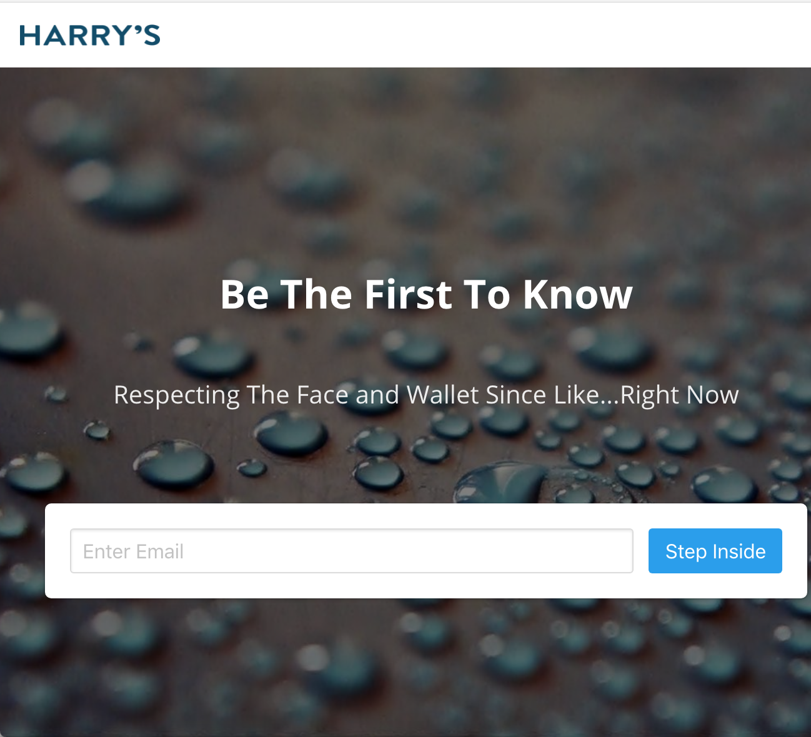

# Flask-Prelaunchr
Originally inspired by [Harrys Tech Prelaunchr](https://github.com/harrystech/prelaunchr). Flask-Prelaunchr is a Flask application for starting a viral prelaunch campaign for new companies or products. This application helps create a buzz around your brand with a prelaunch campaign. The prelaunch campaign will helped us gather legitimate email addresses to whom we could announce your launch.

The campaign is conducive to social sharing and has prize levels based on the number of people each person refers. By default, this includes an HTML/CSS for template based on [Bulma](http://bulma.io) and the original campaign email template.   

## How it works
Flask-Prelaunchr has a main mechanic from which everything else is derived: Every User is given a unique referral_code which is how the application knows who referred a signing up user. Based on the amount of referrals a User has brought to the site, they are put into a different "prize group". The groups, amounts, and prizes are completely up to you to set.

Users are prompted to enter their email address. This generates a unique referral code, saves the ip address, and creates a cookie-based session. Upon form completion, the user is taken to a page with which they may share their given referral code or see how they rank in terms of number of referrals generated. Users must earn more referrals in order to win prizes. This is stressed by bouncing users who have already signed up to the referral page, should they attempt to go to the original URL again.

## IP Blocking
The count of each unique ip address address signup is also saved. When an ip address is found to have been saved more than 2 times, that user and all subsequent referred users are flagged as suspicious.

## Screenshot



## Setup
### Local
```
    virtualenv env
    source venv/bin/activate
    pip install -r requirements.txt
    export FLASK_APP=manage.py
    export FLASK_CONFIG=production
    flask shell
    db.create_all()
    flask run
    open http://localhost:5000/
```

### Docker

```
    docker-compose build
    docker-compose up -d
    docker-compose exec prelaunchr flask shell
    db.create_all()
    open http://localhost:5000/
```

## Admin Interface
A basic admin interface is available at /admin. Authentication is managed by HTTP Basic Authentication using BASIC_AUTH_USERNAME variable. Please make sure that you use SSL/TLS (HTTPS) to encrypt the connection between the client and the server, when using basic access authentication.

## Configuration
Create a .env file in the root of the project. Add the following
``` 
    AWS_ACCESS_KEY_ID="XXXXX"
    AWS_SECRET_ACCESS_KEY="XXXX"
    BASIC_AUTH_USERNAME="foo"
    BASIC_AUTH_PASSWORD="bar"
    SECRET_KEY="*****"
```

Edit config.py with your email from address

```
SES_EMAIL_SOURCE = "Hello <admin@domain.com>"
```

## Credits
[https://github.com/jeeschr/django-prelaunchr/](https://github.com/jeeschr/django-prelaunchr/)
[https://github.com/harrystech/prelaunchr](https://github.com/harrystech/prelaunchr)